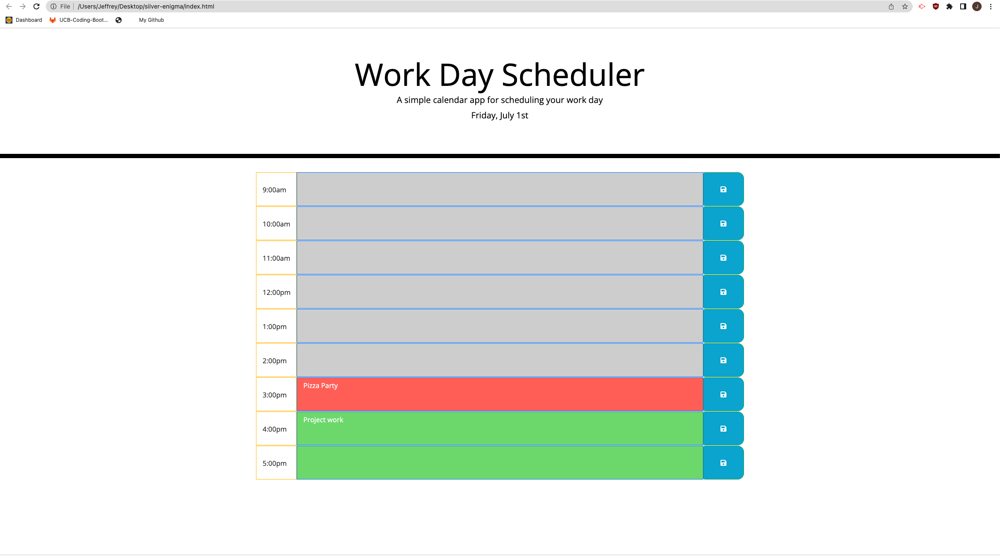

# Work day scheduler

## Deployment link

https://jeffz98.github.io/silver-enigma/

## GIF demo


## Screenshots


### User Information
- [LinkedIn](https://www.linkedin.com/in/jeffrey-zhang-52315522a/)
- [Portfolio](https://jeffz98.github.io/Twilights_Portfolio/)

## Description
This application is a daily scheduler that allows the user to save events for each hour of the day. It runs in the browser and is updated dynamically by HTML and CSS while being powered by jQuery.
## Code Snippets

```
$("button").each(function(){
    var trackTime = $(this).attr("hour-time");
    var dataStorage = localStorage.getItem(trackTime);
    $(this).siblings("textarea").val(dataStorage)
    // compares the time slot selected to the current hour to determine color
    if (trackTime < hourToday) {
        $(this).siblings("textarea").addClass("past")
    } else if(trackTime == hourToday) {
        $(this).siblings("textarea").addClass("present")
    } else {
        $(this).siblings("textarea").addClass("future")
    }
})
```

In the above code snippet, I am looping through each text field with the button tag and setting them to a certain color based on the current time of the day. It will also ensure that the page will store these variabels when refreshed.


## Technologies Used

HTML, CSS, JavaScript, and Git


